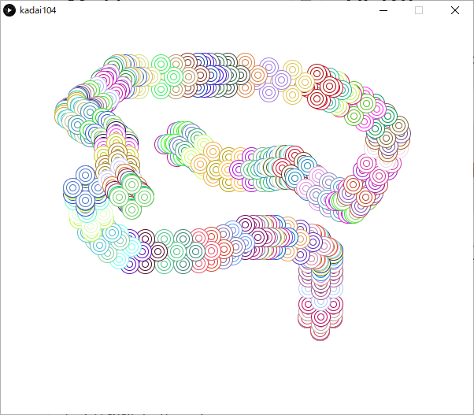

<!-- 表紙 -->

<div style="text-align: center;">
<div style="font-size: 32px;margin: 240px auto 0px">
第一回レポート
</div>
<div style="font-size: 24px;margin: 160px auto 0px">
報告者：EC2-10 山﨑 敦史
</div>
<div style="font-size: 24px;margin: 80px auto 160px">
提出日: 令和4年 5月9日
</div>
</div>

<div style="page-break-before:always"></div>

<!-- 以下レポート -->

# 課題1-1
>sample04のプログラムを変更して、「c」のkeyが押されたとき、画面をリセットできるように変更したkadai101を作成せよ。

ソースコードと実行画面の画像を以下に示す。

kadai101.pde
```c++
void setup() {
    size(600,500);
    background(255,255,255);
}

void draw() {
    if (mousePressed == true) {
        stroke(random(256),random(256), random(256));
        ellipse(mouseX, mouseY, 24 , 24);
        ellipse(mouseX, mouseY, 16 , 16);
        ellipse(mouseX, mouseY, 8 , 8);
    }
}

void keyPressed(){
    if(key == 'c'){
        background(255,255,255);
    }
}
```

kadai101 実行画面の画像


# 課題1-2
>上記 [課題1-1] のプログラムにおいて、三重の円を描く部分を、
for分を用いて繰り返し実現できるよう変更したkadai102を作成せよ

ソースコードと実行画面の画像を以下に示す。

kadai102.pde
```c++
void setup() {
    size(600,500);
    background(255,255,255);
}

void draw() {
    if (mousePressed == true) {
        stroke(random(256),random(256), random(256));
        threefoldEllipse();
    }
}

void keyPressed() {
    if (key == 'c') {
        background(255,255,255);
    }
}

void threefoldEllipse() {
    int baseSize = 8;
    for (int i = 3; i > 0; i--) {
        // ellipseは中が塗りつぶされているため、大きい順に描く必要がある
        ellipse(mouseX, mouseY, baseSize * i, baseSize * i);
    }
}
```

kadai102 実行画面の画像


# 課題1-3
>上記 [課題1-2] のプログラムにおいて、三重の円を描く部分を、
三重の正方形に変更して描画できるkadai103を作成せよ。

ソースコードと実行画面の画像を以下に示す。


kadai103.pde
```c++
void setup() {
    size(600,500);
    background(255,255,255);
}

void draw() {
    if (mousePressed == true) {
        stroke(random(256),random(256), random(256));
        threefoldEllipse();
    }
}

void keyPressed() {
    if (key == 'c') {
        background(255,255,255);
    }
}

void threefoldEllipse() {
    int baseSize = 8;
    for (int i = 3; i > 0; i--) {
        // ellipseは中が塗りつぶされているため、大きい順に描く必要がある
        rectMode(CENTER);
        square(mouseX, mouseY, baseSize * i);
    }
}
```
kadai103 実行画面の画像


# 課題1-4
>上記 [課題1-2] のプログラムにおいて、三重の辺を上下左右に16ピクセルずつずらして同時に重ね、花弁風の図形を描けるkadai104を作成せよ

ソースコードと実行画面の画像を以下に示す。

kadai104.pde
```c++
void setup() {
    size(600,500);
    background(255,255,255);
}

void draw() {
    if (mousePressed == true) {
        stroke(random(256),random(256), random(256));
        threefoldEllipse(0,16);
        threefoldEllipse(16,0);
        threefoldEllipse(0,-16);
        threefoldEllipse(-16,0);
    }
}

void keyPressed() {
    if (key == 'c') {
        background(255,255,255);
    }
}

void threefoldEllipse(int positionX, int positionY) {
    int baseSize = 8;
    for (int i = 3; i > 0; i--) {
        // ellipseは中が塗りつぶされているため、大きい順に描く必要がある
        ellipse(mouseX + positionX, mouseY + positionY, baseSize * i, baseSize * i);
    }
}
```

kadai104 実行画面の画像


# 課題2-1
>sample05の`background()`関数をコメントアウトすると、
前に描画した図形の軌跡が残る。
これをさらに変更してウィンドウの枠にあたると図形の色がランダムに変化する
kadai201を作成せよ

ソースコードと実行画面の画像を以下に示す。

kadai201.pde
```c++
float x,y;
float dx = 2.0, dy = 2.0;

void setup() {
    size(600, 500);
    background(128, 128, 128);
    stroke(128, 128, 128);
    fill(255,255);
    
    x = random(20, width - 20);
    y = random(20, height - 20);
}

void draw() {
    x = x + dx;
    y = y + dy;
    
    if ((x < 10) || (x>(width - 10))) {
        dx = -dx;
        stroke(random(256),random(256), random(256));
    }
    if ((y < 10) || (y>(height - 10))) {
        dy = -dy;
        stroke(random(256),random(256), random(256));
    }
    ellipse(x,y,20,20);
}

```

kadai201 実行画面の画像


# 課題2-2
>sample05を変更して、長方形のラケットで円（ボール）の図形を打ち返すことができるプログラムを考える\
このとき、長方形のラケットと円（ボール）の図形の衝突判定の条件式はどのように記述すればよいか示せ。\
ただし、長方形のラケットは次のように設定することとし、長方形のラケットの中心座標を`x1`,`y1`とする。なお`setup()`関数の中で`rectMode(CENTER)`関数が実行されているものとする。

ラケットの中心座標を`racketX`,`racketY`と再定義し、ラケットの横幅と縦幅を`racketW`,`racketH`、ボールの半径を`radius`と定義して
ソースコードを以下に示す。

kadai201.pde
```c++
boolean isCollision() {
    float halfW = racketW / 2;
    float halfH = racketH / 2;
    
    boolean overlappingX = (racketX - halfW)<(x + radius) && (racketX + halfW)>(x - radius);
    boolean overlappingY = (racketY - halfH)<(y + radius) && (racketY + halfH)>(y - radius);
    
    return overlappingX && overlappingY;
}
```


# 課題2-3
>sample05を変更して、長方形のラケットで円（ボール）の図形を打ち返すプログラムkadai203を作成せよ


ソースコードと実行画面の画像を以下に示す。

kadai203.pde
```c++
class Collisioning{
    Collisioning(boolean x, boolean y) {
        this.x = x;
        this.y = y;
    }
    boolean x, y;
}

float x,y,radius;
float dx = 2.0, dy = 2.0;

float racketX = 300 , racketY = 400;
float racketW = 50, racketH = 10;

void setup() {
    size(600, 500);
    background(128, 128, 128);
    stroke(128, 128, 128);
    fill(255,255);
    
    x = random(20, width - 20);
    y = random(20, height - 20);
    radius = 10;
    rectMode(CENTER);
}

void draw() {
    background(128, 128, 128);
    Collisioning collisioning = collision();
    if ((x < 10) || (x>(width - 10)) || collisioning.x) {
        dx = -dx;
    }
    if ((y < 10) || (y>(height - 10)) ||  collisioning.y) {
        dy = -dy;
    }
    x = x + dx;
    y = y + dy;
    ellipse(x,y,radius * 2,radius * 2);
    rect(racketX, racketY, racketW, racketH);
}

Collisioning collision() {
    boolean overlappingX = isOverlappingX(x + radius, x - radius);
    boolean overlappingY = isOverlappingY(y + radius, y - radius);
    boolean isCollision = overlappingX && overlappingY;
    
    if (isCollision) {
        boolean isCollisionHorizen = isOverlappingY(y,y);
        boolean isCollisionVertical = isOverlappingX(x,x);
        return new Collisioning(isCollisionHorizen,isCollisionVertical);
    } else{
        return new Collisioning(false,false);
    }
}

boolean isOverlappingX(float upper, float lower) {
    float halfW = racketW / 2;
    return(racketX - halfW)<(upper) && (racketX + halfW)>(lower);
}

boolean isOverlappingY(float upper, float lower) {
    float halfH = racketH / 2;
    return(racketY - halfH)<(upper) && (racketY + halfH)>(lower);
}

void keyPressed() {
    if (key ==  CODED) {
        if (keyCode == RIGHT) {
            racketX += 20;
        }
        if (keyCode == LEFT) {
            racketX -= 20;
        }
    }
}
```

kadai203 実行画面の画像

