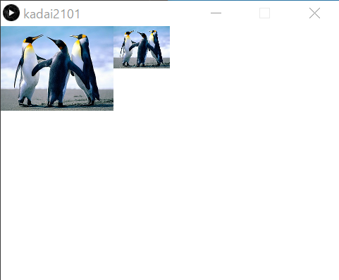
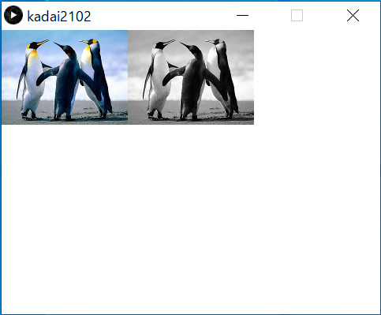
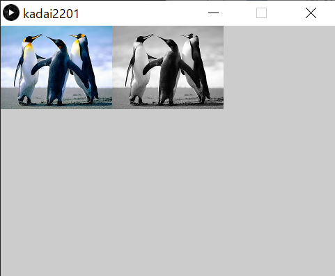
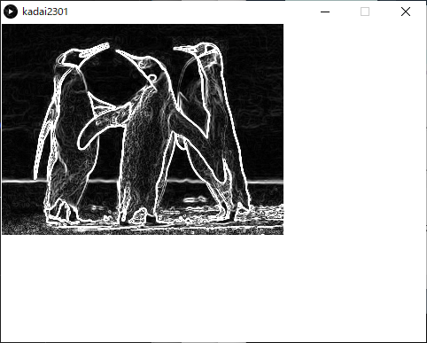
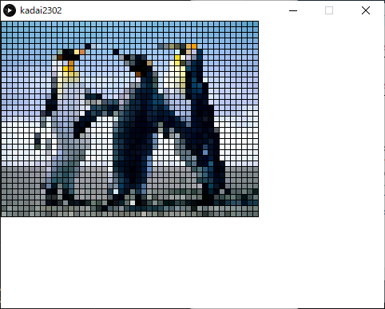

<!-- 表紙 -->

<div style="text-align: center;">
<div style="font-size: 32px;margin: 240px auto 0px">
第二回レポート
</div>
<div style="font-size: 24px;margin: 160px auto 0px">
報告者：EC2-10 山﨑 敦史
</div>
<div style="font-size: 24px;margin: 80px auto 160px">
提出日: 令和4年 6月12日
</div>
</div>

<div style="page-break-before:always"></div>

<!-- 以下レポート -->

# 課題1-1
>画像データimage001.pngを1/2の大きさで表示し、その右横に1/4の大きさで同じ画像を並べて表示するプログラムを作成せよ

ソースコードと実行画面の画像を以下に示す。

kadai2101.pde
```c++
PImage img1;
void setup() {
  size(480, 360);
  img1 = loadImage("image001.png");
}

void draw() {
  background(255,255,255);
  image(img1, 0, 0, img1.width / 2, img1.height / 2);
  image(img1, img1.width / 2, 0, img1.width / 4, img1.height / 4);
}
```

kadai2101 実行画面の画像




# 課題1-2
>画像データimage001.pngを1/2の大きさでフルカラー表示し、その右側にグレイスケール化した1/2の大きさの画像を並べて表示するプログラムを作成せよ

ソースコードと実行画面の画像を以下に示す。

kadai2102.pde
```c++
PImage img1;
void setup() {
  size(480, 360);
  img1 = loadImage("image001.png");
}

void draw() {
  background(255,255,255);
  image(img1, 0, 0, img1.width / 2, img1.height / 2);
  PImage grayImg = img1.copy();
  grayImg.filter(GRAY);
  image(grayImg, img1.width / 2, 0, img1.width / 2, img1.height / 2);
}
```

kadai2102 実行画面の画像



# 課題2-1
>マウスの右ボタンが押されたとき、画像データimage001.pngを1/2の大きさでフルカラー表示し、その右側にグレイスケール化した1/2の大きさの画像を並べて表示する。
さらに、キーワードの`b`を押すと右側の画像が二値画像に変化し、`g`を押すと右側の画像がグレイスケール画像に変化する。
そして`c`を押すと全体が消去されるプログラムを作成せよ


ソースコードと実行画面の画像を以下に示す。

kadai2201.pde
```c++
PImage img1;
PImage defaultImg;
String mode = "GRAY";
void setup() {
  size(480, 360);
  img1 = loadImage("image001.png");
  defaultImg = img1.copy();
}

void draw() {
  int width = img1.width / 2;
  int height = img1.height / 2;
  image(defaultImg, 0, 0, width, height);
  image(img1, width, 0, width, height);
  
  if (mousePressed && (mouseButton == RIGHT)) {
    mode = "COLOR";
  }
  switch(mode) {
    case "CLEAR":
      background(255,255,255);
      break;
    
    case "GRAY":
      img1.filter(GRAY);
      break;
    
    case "COLOR":
      img1 = defaultImg.copy();
      break;
    
    case "BINARY":
      img1.filter(THRESHOLD);
      
      default :
      break;	
  }
  
  
}

void keyPressed() {
  if (key == 'c') {
    mode = "CLEAR";
  }
  if (key == 'b') {
    mode = "BINARY";
  }
  if (key == 'g') {
    mode = "GRAY";
  }
}
```

kadai2201 実行画面の画像




# 検討課題
>カラー画像をグレイスケールに変換する場合、視覚の色感度による補正を行ってグレイスケールの画像に変換する。
これにより自然な感じのグレイスケール画像になる。
どのような補正を行うのか調べ、その変換式を説明せよ

```math
Gray = Red * 0.3 + Green * 0.59 + Blue * 0.11
```
人間の目にはGreen > Red > Blueの順番で明るく見えるためこのような補正になる。


# 課題3-1
>画像データpicture001.pngを使用し、Sobelフィルターを利用してエッジを抽出するプログラムを作成せよ
マウスの右ボタンが押されたとき、画像データpicture001.pngをフルカラー表示し、`a`を押すとエッジ画像の表示に変化し、`c`を押すと全体が消去されるプログラムを作成せよ

ソースコードと実行画面の画像を以下に示す。

kadai2301.pde
```c++
PImage img;
PImage imgCache;
void setup() {
  size(480, 360);
  img = loadImage("image001.png");
  imgCache = img.copy();
}

final String colorMode = "color";
final String edgeMode = "edge";
final String clearMode = "clear";
final String noneMode = "none";
String mode = colorMode;

void draw() {
  image(img, 0, 0, img.width, img.height);

  if (mousePressed && (mouseButton == RIGHT)) {
    mode = colorMode;
  }
  
  switch(mode) {
    case colorMode:
      img = imgCache;
      break;
    
    case edgeMode:
      img = sobelFilter(img);
      mode = noneMode;
      break;

    case clearMode:
      background(255,255,255);
      break;
    
    default:
      break;
  }
}

void keyPressed() {
  if (key == 'c') {
    mode = clearMode;
  }
  if (key == 'a') {
    mode = edgeMode;
  }
}

PImage sobelFilter(PImage img) {
  PImage filteredImg = img.copy();
  for (int x = 0; x < img.width; ++x) {
    for (int y = 0;y < img.height; ++y) {
      float fx=0, fy=0;
      fx=fx+(-1)*brightness(img.get(x-1,y-1));
      fx=fx+(-2)*brightness(img.get(x-1,y));
      fx=fx+(-1)*brightness(img.get(x-1,y+1));
      fx=fx+( 1)*brightness(img.get(x+1,y-1));
      fx=fx+( 2)*brightness(img.get(x+1,y));
      fx=fx+( 1)*brightness(img.get(x+1,y+1));
      fy=fy+(-1)*brightness(img.get(x-1,y-1));
      fy=fy+(-2)*brightness(img.get(x,y-1));
      fy=fy+(-1)*brightness(img.get(x+1,y-1));
      fy=fy+( 1)*brightness(img.get(x-1,y+1));
      fy=fy+( 2)*brightness(img.get(x,y+1));
      fy=fy+( 1)*brightness(img.get(x+1,y+1));
      float rr=sqrt(fx*fx+fy*fy);
      color c=color(rr);
      filteredImg.set(x,y,c);
      }
  }
  return filteredImg;
}
```

kadai2301 実行画面の画像



# 課題3-2
>画像データpicture001.pngを使用し、モザイク表示に変化するプログラムを作成せよ

ソースコードと実行画面の画像を以下に示す。

kadai2302.pde
```c++
PImage img;
PImage imgCache;
void setup() {
  size(480, 360);
  img = loadImage("image001.png");
  imgCache = img.copy();
}

final String colorMode = "color";
final String clearMode = "clear";
final String mosaicMode = "mosaic";
final String noneMode = "none";

String mode = colorMode;
int mosaicNum = 2;

void draw() {
  image(img, 0, 0, img.width, img.height);

  if (mousePressed && (mouseButton == RIGHT)) {
    mode = colorMode;
  }
  
  switch(mode) {
    case colorMode:
      img = imgCache;
      break;

    case clearMode:
      background(255,255,255);
      break;

    case mosaicMode:
      background(255,255,255);
      displayMosaic(img,mosaicNum);
      break;
    
    default:
      break;
  }
}

void keyPressed() {
  if (key == 'c') {
    mode = clearMode;
  }
  if (key == '0') {
    mode = mosaicMode;
  }
  if (key == '2') {
    mosaicNum = 2;
  }
  if (key == '3') {
    mosaicNum = 3;
  }
  if (key == '4') {
    mosaicNum = 4;
  }
  if (key == '5') {
    mosaicNum = 5;
  }
  if (key == '6') {
    mosaicNum = 6;
  }
  if (key == '7') {
    mosaicNum = 7;
  }
  if (key == '8') {
    mosaicNum = 8;
  }
  if (key == '9') {
    mosaicNum = 9;
  }
}

void displayMosaic(PImage img, int mosaicNum){;
for (int y = 0; y < img.height; y += mosaicNum) {
  for (int x = 0; x < img.width; x += mosaicNum) {
      final color c = img.pixels[ y * img.width + x];
      fill(c);
      rect(x, y, mosaicNum, mosaicNum);
    }
  }
}
```

kadai2302 実行画面の画像



# 検討課題
>Sobelフィルタによりエッジが検出できる仕組みについて調べ、説明せよ

周辺ピクセルとの差分を微分しているため