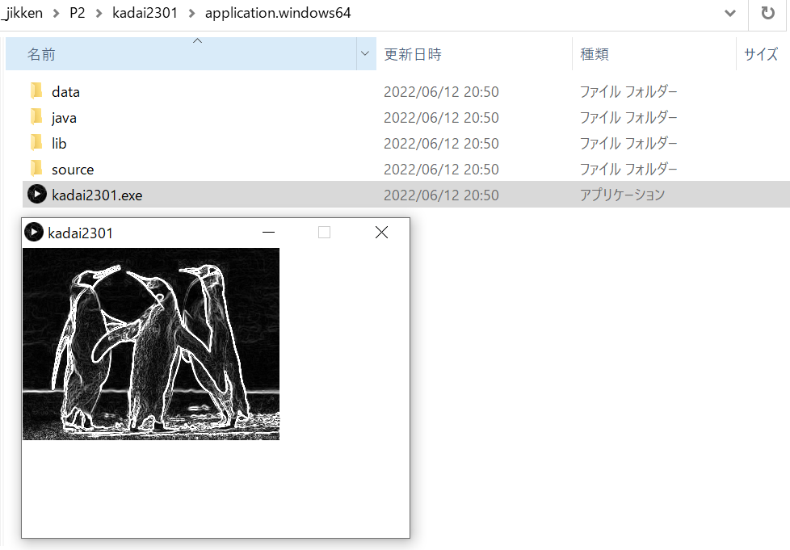

<!-- 表紙 -->

<div style="text-align: center;">
<div style="font-size: 32px;margin: 240px auto 0px">
第三回レポート
</div>
<div style="font-size: 24px;margin: 160px auto 0px">
報告者：EC2-10 山﨑 敦史
</div>
<div style="font-size: 24px;margin: 80px auto 160px">
提出日: 令和4年 6月13日
</div>
</div>

<div style="page-break-before:always"></div>

<!-- 以下レポート -->

# 課題1-1
>プログラミング(2)の課題3-1で作成したsobelフィルタのプログラムをJavaアプリケーションとしてエクスポートせよ。

実行画面の画像を以下に示す。

実行画面の画像


# 課題1-2
>ライブラリの追加機能を用いて、2D物理エンジン・シミュレーションの
「Box2D for Processing」ライブラリをインストールし、サンプルプログラム「Boxes」を実行確認せよ。
bxの値を11,22,33で変化させ、板の穴の大きさ（2 * bx）を変えてシミュレーションせよ。

bxの値が大きいほど詰まりにくい

bx = 33の場合のソースコードと実行画面の画像を以下に示す。

```c++
// The Nature of Code
// <http://www.shiffman.net/teaching/nature>
// Spring 2011
// Box2DProcessing example

// Basic example of falling rectangles

import shiffman.box2d.*;
import org.jbox2d.collision.shapes.*;
import org.jbox2d.common.*;
import org.jbox2d.dynamics.*;

// A reference to our box2d world
Box2DProcessing box2d;

// A list we'll use to track fixed objects
ArrayList<Boundary> boundaries;
// A list for all of our rectangles
ArrayList<Box> boxes;
int bx = 33;
void setup() {
  size(640,360);
  smooth();

  // Initialize box2d physics and create the world
  box2d = new Box2DProcessing(this);
  box2d.createWorld();
  // We are setting a custom gravity
  box2d.setGravity(0, -10);

  // Create ArrayLists	
  boxes = new ArrayList<Box>();
  boundaries = new ArrayList<Boundary>();

  // Add a bunch of fixed boundaries
  boundaries.add(new Boundary(width/4-bx,height-50,width/2,40));
  boundaries.add(new Boundary(3*width/4+bx,height-50,width/2,40));
}

void draw() {
  background(255);

  // We must always step through time!
  box2d.step();

  // Boxes fall from the top every so often
  if (random(1) < 0.2) {
    Box p = new Box(width/2,30);
    boxes.add(p);
  }

  // Display all the boundaries
  for (Boundary wall: boundaries) {
    wall.display();
  }

  // Display all the boxes
  for (Box b: boxes) {
    b.display();
  }

  // Boxes that leave the screen, we delete them
  // (note they have to be deleted from both the box2d world and our list
  for (int i = boxes.size()-1; i >= 0; i--) {
    Box b = boxes.get(i);
    if (b.done()) {
      boxes.remove(i);
    }
  }
}
```

実行画面の画像


# 課題3-1
>sample.pdeのsobelフィルタのプログラムを入力し、実行を確認し報告せよ。

実行画面の画像を以下に示す。

実行画面の画像


# 課題3-2
>sample302.pdeの物体の輪郭抽出プログラムを入力し、9行目の閾値を60,90,120と変化させたとき
の実行を確認し、輪郭抽出がどのように変化するか報告せよ

閾値が大きくなると、輪郭抽出をする箇所が増えた。

| 閾値 | 60 | 90 | 120 |
| -- | -- | -- | -- |
| 実行画像 |  |  |  |


# 検討課題1
>エッジ検出の手法としてcannyフィルタが知られている。sobelフィルタとの違いと利点を調べ報告せよ。

1. 輪郭の検出漏れや誤検出が少ない
2. 各店に一本の輪郭を検出する
3. 真にエッジの部分を検出する

# 検討課題2
>顔認識の手法としてHaar-like特徴を用いた方法が知られている。どのような手法か調べて報告せよ

- Haar-likeとよばれる明暗で構成される矩形のパターンを検出に使う手法
- 予め特徴分類器を作っておいてそのパターンに合うかどうかで検出する。