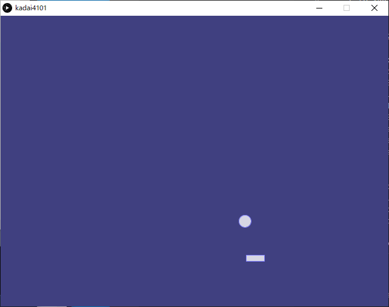
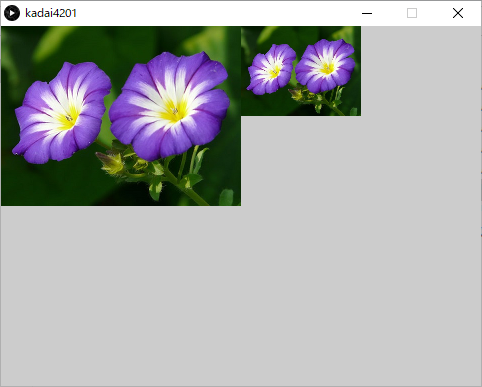

<!-- 表紙 -->

<div style="text-align: center;">
<div style="font-size: 32px;margin: 240px auto 0px">
第四回レポート
</div>
<div style="font-size: 24px;margin: 160px auto 0px">
報告者：EC2-10 山﨑 敦史
</div>
<div style="font-size: 24px;margin: 80px auto 160px">
提出日: 令和4年 6月27日
</div>
</div>

<div style="page-break-before:always"></div>

<!-- 以下レポート -->

# 課題1-1
>sample402.pydeを改良して、長方形のラケットでボールを打ち返すプログラムkadai4101.pydeをpythonモードで作成せよ

ソースコードと実行画面の画像を以下に示す。

kadai4101.pyde
```py
ballX=0
ballY=0
ballRadius = 10

dx=2.0
dy=2.0

racketX=320
racketY=400
racketW=30
racketH=10
racketMove=20

def setup():
    global ballX,ballY
    size(640,480)
    background(64,64,128)
    stroke(128,128,255)
    fill(255,200)
    ballX=random(20,width-20)
    ballY=random(20,height-20)
    rectMode(CENTER)
    
def draw():
    global ballX,ballY,dx,dy
    background(64,64,128)
    ballX+=dx
    ballY+=dy
    
    if ballX<10 or ballX > width-10:
        dx = -dx
    if ballY<10 or ballY > height-10 or isCollision():
        dy = -dy
        
    
    ellipse(ballX,ballY,ballRadius*2, ballRadius*2)
    rect(racketX, racketY, racketW, racketH)
    
def isCollision():
    global ballX,ballY,ballRadius
    overlappingX = isOverlappingX(ballX + ballRadius, ballX - ballRadius)
    overlappingY = isOverlappingY(ballY + ballRadius, ballY - ballRadius)
    return overlappingX and overlappingY

def isOverlappingX(upper, lower):
    global racketW
    halfW = racketW/2
    return (racketX - halfW) < upper and (racketX + halfW) > lower

def isOverlappingY(upper, lower):
    global racketH
    halfH = racketH/2
    return(racketY - halfH)<(upper) and (racketY + halfH)>(lower)
                            

def keyPressed():
    global racketX, racketY, racketMove
    if key == CODED:
        if keyCode == RIGHT:
            racketX += racketMove
        if keyCode == LEFT:
            racketX -= racketMove

```

kadai 実行画面の画像


# 課題2-1
>sample403.pydeを参考にして、元画像の横に1/2スケールの画像を並べて表示するkadai4201.pydeのプログラムを作成せよ

ソースコードと実行画面の画像を以下に示す。

kadai4201.pyde
```py
def setup():
    global img
    img = loadImage("picture002.jpg")
    size(480,360)
    
def draw():
    image(img, 0, 0, img.width / 2, img.height / 2)
    image(img, img.width / 2, 0, img.width / 4, img.height / 4)
```

kadai 実行画面の画像



# 課題2-2
>マウスの右ボタンが押されたとき、画像データimage001.pngをフルカラー表示し`b`を押すと画像が2値画像に変化し、`g`を押すと画像がグレイスケール画像に変化し、`i`をオスと反転画像（ネガ画像）に変化し、`c`を押すと全体が消去されるプログラムを作成せよ。
画像の返還には`filter()`を使用すること。実行ウィンドウの下側に操作キーの説明を表示すること。

ソースコードと実行画面の画像を以下に示す。

kadai4202.pyde
```py
gray = "GLAY"
color = "COLOR"
nega = "NEGA"
clear = "CLEAR"
binary = "BINARY"
none = "NONE"

def setup():
    size(480, 360)
    
    global mode
    mode = color
    global cacheImg, displayImg
    cacheImg = loadImage("picture002.jpg")
    displayImg = cacheImg.copy()
    
def draw():
    global mode
    
    if mousePressed and (mouseButton == RIGHT):
        mode = color
    
    filterSwitcher()
    mode = none
    text("Mouse-RIGHT: Color,  C: Clear",10, 340)
    text("G: Gray,  I: Nega,  B: Binary",10, 350)
    
    
def filterSwitcher():
    global displayImg, cacheImg, mode
    
    if mode == clear:
        background(255,255,255)
        return
    
    if mode == none:
        return
    
    if mode == gray:
        displayImg = cacheImg.copy()
        displayImg.filter(GRAY)
    
    if mode == binary:
        displayImg = cacheImg.copy()
        displayImg.filter(THRESHOLD,0.5)
    
    if mode == nega:
        displayImg = cacheImg.copy()
        displayImg.filter(INVERT)
    
    if mode == color:
        displayImg = cacheImg.copy()
           
    image(displayImg,0,0)

def negaFilter():
    return

def keyPressed():
    global mode
    if key == "c":
        mode = clear
        
    if key == "b":
        mode = binary
        
    if key == "i":
        mode = nega
    
    if key == "g":
        mode = gray
```

kadai4202 実行画面の画像


# 課題3-1
>リスト６のsample404.pydeを参考にして、枝分かれの角度aを0～90までキー操作で変更できるようにし、木のフラクタル図形の変化を確認できるプログラムを作成せよ。角度aは初期値を60とし、上向きカーソルキーまたは下向きカーソルキーを押すことで、１ずつ増減できるようにすること。

ソースコードと実行画面の画像を以下に示す。

kadai4301.pde
```py
angle = 60
decreace = 0.66

def setup():
    size(640,360)
    
def draw():
    background(255)
    stroke(0)
    translate(width / 2, height)
    line(0,0,0,-120)
    translate(1,-120)
    branch(120,radians(angle))
    
def branch(h, theta):
    h *= decreace
    if h > 2:
        pushMatrix()
        rotate(theta)
        line(0,0,0,-h)
        translate(0,-h)
        branch(h,theta)
        popMatrix()
        with pushMatrix():
            rotate(-theta)
            line(0,0,0,-h)
            translate(0,-h)
            branch(h,theta)

def incrementAngle():
    global angle
    if angle < 90:
        angle += 1

def decrementAngle():
    global angle
    if angle > 0:
        angle -=1
        
def keyPressed():
    if key == CODED:
        if keyCode == UP:
            incrementAngle()
        
        if keyCode == DOWN:
            decrementAngle()

```

kadai4301 実行画面の画像


# 検討課題1
>リスト６における制御文の「with」（下から6行目）について、どのような制御を行っているのか調査し説明せよ。

ある一定の期間だけオブジェクトを使用したり、いろいろな設定を行って用事がすんだら元に戻したい、という処理を行う

# 検討課題2
>フラクタル図形としては他にどのようなものがあるか調査し、事例を上げて説明せよ。

フラクタル図形は次のような種類がある

- カントール集合
- シェルピンスキーのギャスケット
- コッホ曲線
- ペアノ曲線
- 高木曲線
- ヒルベルト曲線
- マンデルブロ集合
- ジュリア集合
- メンガーのスポンジ
- ロマネスコ・ブロッコリー - 明確なフラクタル図形をした野菜。
- バーニングシップ・フラクタル
- リアプノフ・フラクタル
- バーンズリーのシダ