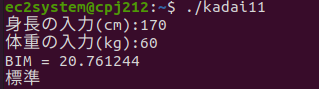
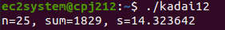

<!-- 表紙 -->

<div style="text-align: center;">
<div style="font-size: 32px;margin: 240px auto 0px">
第五回レポート
</div>
<div style="font-size: 24px;margin: 160px auto 0px">
報告者：EC2-10 山﨑 敦史
</div>
<div style="font-size: 24px;margin: 80px auto 160px">
提出日: 令和4年 7月11日
</div>
</div>

<div style="page-break-before:always"></div>

<!-- 以下レポート -->

# 課題1-1
>ルートディレクトリの下には多くのサブディレクトリがある。
コマンド、ライブラリ、システムツールなどは、サブディレクトリに分けられて格納されている。
ルートディレクトリの下のサブディレクトリの一覧を表示させ、その一覧をテキストファイルに書き込み提出せよ。
各サブディレクトリの役割あるいは格納されているファイルの種類を説明せよ

```bash
ll /
ll / > root_dir.txt
```

# 課題1-2
>コマンド行で呼び出すコマンド群は、環境変数PATHに登録されたディレクトリに保存されている。
printenvコマンドにより環境変数PATHの一覧を表示させ、
その一覧をテキストファイルに書き込み提出せよ

```bash
printenv PATH
printenv PATH > path_list.txt
```

付録1-2にテキストファイルを示す。

# 課題1-3
>`du`コマンドを使って自分のホームディレクトリの使用容量をkバイト単位で報告せよ。

```bash
du -s -k
```

16460KB

# 課題1-4
>Webブラウザのプロキシ設定を行い、インターネットにアクセスできることを確認せよ。

以下の画像に示すようにインターネット接続が確認できた


# 課題1-5
>`ll`コマンド、または`ls`コマンドにオプション命令の`-l`を付けると
ファイルの属性が表示される。
ファイルの属性の表示形式と項目の意味を、オンラインマニュアルあるいはインターネット検索で調べ報告せよ。

例
```bash
drwxrwxrwx   1   kawai   teacher   650   11 14   2002   temp2
```


| 項 | 例 | 属性 |
| ---- | --- | --- |
| 1 | drwxrwxrwx | ファイルの種類と許可属性 |
| 2 | 1 | ハードリンク数 |
| 3 | kawai | 所有者 |
| 4 | teacher | グループ |
| 5 | 650 | ファイルサイズ |
| 6 | 11 14 | タイムスタンプ（月日） |
| 7 | 2002 | タイムスタンプ（年） |
| 8 | temp | ファイル名 |

### ファイルの種類と許可属性

この項目はファイルの種類と、ファイルに対する操作の許可が示されている。

`drwxrwxrwx`

先頭の文字はファイルの種類を表す
|  |  |
| -- | -- | 
| - | ファイル |
| d | ディレクトリ |
| i | シンボリックファイル（ショートカット）|


`rwx`は操作権限を表している
|  |  |
| -- | -- | 
| - | 権限なし |
| r | 読み取り |
| w | 書き込み|
| x | 実行 |


よって`drwxrwxrwx`は次のように意味する
| ファイルの種類 | ユーザの権限 | グループの権限 | 他ユーザの権限 |
| -- | -- | -- | -- |
| d | rwx | rwx | rwx|

### ハードリンク数
引用
>UNIXでは、ファイルを作成する際、ファイルを構成するブロックが確保される。
これをディレクトリエントリという特殊なファイルに記載し、ファイル名と対応付ける操作が行なわれる。
狭義には、これを(ハード)リンクという。

>ファイルを作成した際に名前が付くため、ハードリンクの数は初期状態で1となる。
ディレクトリの場合は、自分の名前と親ディレクトリからのリンクがあるために、リンク数は最低でも2となる。
明示的に別の名前でハードリンクを行なうと、ファイルの持つリンク数が増えていく。

# 検討課題1-1
>`chmod`コマンドファイルの属性を設定するには8進数による設定をシンボルコードによる設定がある。
これらの設定方法を調べ報告せよ。

| 8進数 | シンボルコード |
| :-: | :-:|
| 0 | --- |
| 1 | --x |
| 2	| -w- |
| 3	| -wx |
| 4	| r-- |
| 5	| r-x |
| 6	| rw- |
| 7	| rwx |

# 検討課題1-2
>プロキシの仕組みと機能について調べ報告せよ。

(Wikipedia引用)
>プロキシ（proxy）とは「代理」の意味である。インターネット関連で用いられる場合は、特に内部ネットワークからインターネット接続を行う際、高速なアクセスや安全な通信などを確保するための中継サーバ「プロキシサーバ」を指す。
>プロキシはクライアントとサーバの間に存在し、情報元のサーバに対してはクライアントの情報を受け取る、クライアントに対してはサーバの働きをする（HTTPプロキシの場合）。

次のような機能が提供される
- 高速なアクセス
- 安全な通信
- 有害サイトの遮断
- 翻訳・変換
- 経路障害の回避
- 検閲回避
# 課題2-1
>すべてのプロセス一覧を表示させ、その内容をテキストファイルに保存し提出せよ

```bash
ps -ax
ps -ax > ps_list.txt
```

付録2-1にテキストファイルを示す。

# 検討課題2-1
> 課題2-1によけるプロセス一覧表の表示項目`PID`,`TTY`, `STAT`,`TIME`
についてオンラインマニュアルまたはインターネット検索で調べ、それぞれ説明せよ。

|項目|名|説明|
|-|-|-|
|PID|プロセスID|プロセスIDとは、オペレーティング（OS）が現在実行中のプロセスを識別するために割り当てる一意な識別子|
|TTY|テレタイプライター|標準出力の接続先デバイス事|
|STAT|ステータス|現在のプロセス状態|
|TIME|タイム|プロセスの経過時間|

# 課題3-1
> 肥満度の評価指数にBMI値がある。BMI値は体重をkg, 身長をmとして`体重 / 身長^2`で求める。
BMI値の評価は次のようになる。

| 値 | 評価 |
| -- | -- |
| 18.5未満 | やせ過ぎ |
| 18.5 ~ 25未満 | 標準 |
| 25 ~ 30未満 | 肥満度1 |
| 30 ~ 35未満 | 肥満度2 |
| 35 ~ 40未満 | 肥満度3 |
| 40以上 | 肥満度4 |

> リスト2のhimand01.cを参考にして名前と身長と体重を入力すると肥満度を表示し、その下にBMI値とその評価を表示するkadai11.cを作れ。
> BMI値を計算するには`bmi()`関数を作りそれを呼び出して表示するプログラムとすること。


ソースコードと実行画面の画像を以下に示す。

kadai11.c
```c++
#include <stdio.h>
#include <math.h>

float calcBmi(float height, float mass){
	return mass / pow(height, 2);
}

char* getObesityLevel(float bmi){
	if(bmi < 18.4){
		return "やせ過ぎ";
	}
	if(bmi < 25){
		return "標準";
	}
	if(bmi < 30){
		return "肥満度１";
	}
	if(bmi < 35){
		return "肥満度２";
	}
	if(bmi < 40){
		return "肥満度３";
	}
	return "肥満度４";
}

void main(){
	float mass, height;
	printf("身長の入力(cm):");
	scanf("%f",&height);
	height = height / 100;
	printf("体重の入力(kg):");
	scanf("%f",&mass);
	
	float bmi = calcBmi(height, mass);
	printf("BIM = %f\n",bmi);
	printf("%s\n",getObesityLevel(bmi));
}
```

kadai 実行画面の画像




# 課題3-2
>n個のデータのバラツキを表す標本標準偏差sは平均値をxaとすると、次のような関係となる。
`s2^　= Σ(xi - xa )2 ／(n - 1)`
リスト３のsum01.cを参考にして、データの個数と合計、平均値、標準偏差（標本標準偏差）を表示するkadai12.cを作れ。整数型の変数から実数の計算を行うには型変換（キャスト）を使う。単精度浮動小数点に変換する場合、次のように記述する。
```c
(float)sum/(float)count;   　　/* 変数sum、countを単精度浮動小数点型に変換して割り算 */
```
>また、データは下記に示すa[ ]の値とする。
```c
a[ ]={79, 85, 80, 43, 58, 85, 61, 75, 46, 59, 65, 78, 84, 92, 83, 57, 66, 90, 88, 90, 86, 77, 81, 63, 58, END};
```

ソースコードと実行画面の画像を以下に示す。

kadai12.c
```c++
#include <stdio.h>
#include <math.h>

#define END -1

void main(){
	int a[]={79, 85, 80, 43, 58, 85, 61, 75, 46, 59, 65, 78, 84, 92, 83, 57, 66, 90, 88, 90, 86, 77, 81, 63, 58, END};
	int sum = 0;
	int n = 0;
	int element = a[n];
	while(element!=END){
		sum += element;	
		n++;
		element=a[n];
	}
	int average = sum/(n);
	
	float s_sum=0;
	int count=0;
	element = a[count];
	while(element!=END){
		s_sum+= pow((element - average),2)/(n - 1);
		count++;
		element=a[count];
	}
	
	float s = sqrt(s_sum);
	
	printf("n=%d, sum=%d, s=%f\n", n, sum, s);
}
```

kadai 実行画面の画像



# 付録1-2
```
/usr/local/sbin:/usr/local/bin:/usr/sbin:/usr/bin:/sbin:/bin:/usr/games:/usr/local/games:/snap/bin
```
# 付録2-1
```
    PID TTY      STAT   TIME COMMAND
      1 ?        Ss     0:11 /sbin/init splash
      2 ?        S      0:00 [kthreadd]
      3 ?        I<     0:00 [rcu_gp]
      4 ?        I<     0:00 [rcu_par_gp]
      6 ?        I<     0:00 [kworker/0:0H-events_highpri]
      9 ?        I<     0:00 [mm_percpu_wq]
     10 ?        S      0:00 [rcu_tasks_rude_]
     11 ?        S      0:00 [rcu_tasks_trace]
     12 ?        S      0:02 [ksoftirqd/0]
     13 ?        I      0:03 [rcu_sched]
     14 ?        S      0:00 [migration/0]
     15 ?        S      0:00 [idle_inject/0]
     16 ?        S      0:00 [cpuhp/0]
     17 ?        S      0:00 [kdevtmpfs]
     18 ?        I<     0:00 [netns]
     19 ?        I<     0:00 [inet_frag_wq]
     20 ?        S      0:00 [kauditd]
     21 ?        S      0:00 [khungtaskd]
     22 ?        S      0:00 [oom_reaper]
     23 ?        I<     0:00 [writeback]
     24 ?        S      0:01 [kcompactd0]
     25 ?        SN     0:00 [ksmd]
     26 ?        SN     0:00 [khugepaged]
     72 ?        I<     0:00 [kintegrityd]
     73 ?        I<     0:00 [kblockd]
     74 ?        I<     0:00 [blkcg_punt_bio]
     75 ?        I<     0:00 [tpm_dev_wq]
     76 ?        I<     0:00 [ata_sff]
     77 ?        I<     0:00 [md]
     78 ?        I<     0:00 [edac-poller]
     79 ?        I<     0:00 [devfreq_wq]
     80 ?        S      0:00 [watchdogd]
     82 ?        I<     0:02 [kworker/0:1H-kblockd]
     84 ?        S      0:04 [kswapd0]
     85 ?        S      0:00 [ecryptfs-kthrea]
     87 ?        I<     0:00 [kthrotld]
     88 ?        I<     0:00 [acpi_thermal_pm]
     90 ?        S      0:00 [scsi_eh_0]
     91 ?        I<     0:00 [scsi_tmf_0]
     92 ?        S      0:00 [scsi_eh_1]
     93 ?        I<     0:00 [scsi_tmf_1]
     95 ?        I<     0:00 [vfio-irqfd-clea]
     96 ?        I<     0:00 [mld]
     97 ?        I<     0:00 [ipv6_addrconf]
    100 ?        I      0:03 [kworker/0:2-cgroup_destroy]
    108 ?        I<     0:00 [kstrp]
    111 ?        I<     0:00 [zswap-shrink]
    112 ?        I<     0:00 [kworker/u3:0]
    117 ?        I<     0:00 [charger_manager]
    156 ?        S      0:00 [scsi_eh_2]
    159 ?        I<     0:00 [scsi_tmf_2]
    180 ?        S      0:00 [jbd2/sda5-8]
    181 ?        I<     0:00 [ext4-rsv-conver]
    221 ?        S<s    0:00 /lib/systemd/systemd-journald
    240 ?        I<     0:00 [ipmi-msghandler]
    248 ?        Ss     0:00 /lib/systemd/systemd-udevd
    254 ?        S<     0:00 [loop0]
    256 ?        S<     0:00 [loop1]
    267 ?        S<     0:00 [loop2]
    277 ?        S<     0:00 [loop4]
    280 ?        S<     0:00 [loop5]
    283 ?        S<     0:00 [loop6]
    284 ?        S<     0:00 [loop7]
    286 ?        S<     0:00 [loop8]
    288 ?        S<     0:00 [loop9]
    290 ?        S<     0:00 [loop10]
    291 ?        S<     0:00 [loop11]
    296 ?        S<     0:00 [loop13]
    301 ?        I<     0:00 [iprt-VBoxWQueue]
    322 ?        I<     0:00 [ttm_swap]
    324 ?        S      0:00 [irq/18-vmwgfx]
    327 ?        S      0:00 [card0-crtc0]
    328 ?        S      0:00 [card0-crtc1]
    329 ?        S      0:00 [card0-crtc2]
    330 ?        S      0:00 [card0-crtc3]
    331 ?        S      0:00 [card0-crtc4]
    334 ?        S      0:00 [card0-crtc5]
    335 ?        S      0:00 [card0-crtc6]
    336 ?        S      0:00 [card0-crtc7]
    337 ?        I<     0:00 [cryptd]
    521 ?        Ss     0:00 /lib/systemd/systemd-resolved
    523 ?        Ssl    0:00 /lib/systemd/systemd-timesyncd
    557 ?        Ssl    0:00 /usr/lib/accountsservice/accounts-daemon
    558 ?        Ss     0:00 /usr/sbin/acpid
    564 ?        Ss     0:00 avahi-daemon: running [cpj212.local]
    566 ?        Ss     0:00 /usr/sbin/cron -f
    568 ?        Ss     0:05 /usr/bin/dbus-daemon --system --address=systemd: --nofork --nopidfile --systemd-activation --syslog-only
    569 ?        Ssl    0:04 /usr/sbin/NetworkManager --no-daemon
    588 ?        Ssl    0:01 /usr/lib/policykit-1/polkitd --no-debug
    601 ?        Ssl    0:00 /usr/libexec/switcheroo-control
    603 ?        Ss     0:00 /lib/systemd/systemd-logind
    605 ?        Ssl    0:00 /usr/lib/udisks2/udisksd
    613 ?        Ss     0:00 /sbin/wpa_supplicant -u -s -O /run/wpa_supplicant
    636 ?        S      0:00 avahi-daemon: chroot helper
    672 ?        Ssl    0:00 /usr/sbin/ModemManager
    679 ?        Ssl    0:00 /usr/libexec/colord
    700 ?        Ssl    0:00 /usr/bin/python3 /usr/share/unattended-upgrades/unattended-upgrade-shutdown --wait-for-signal
    740 ?        Ssl    0:00 /usr/bin/whoopsie -f
    744 ?        Ss     0:00 /usr/sbin/kerneloops --test
    747 ?        Ss     0:00 /usr/sbin/kerneloops
    920 ?        Ssl    0:00 /usr/sbin/gdm3
    929 ?        Sl     0:01 /usr/sbin/VBoxService --pidfile /var/run/vboxadd-service.sh
    970 ?        SNsl   0:00 /usr/libexec/rtkit-daemon
   1057 ?        Ssl    0:00 /usr/lib/upower/upowerd
   1292 ?        Sl     0:00 gdm-session-worker [pam/gdm-password]
   1305 ?        Ss     0:00 /lib/systemd/systemd --user
   1306 ?        S      0:00 (sd-pam)
   1311 ?        S<sl   0:00 /usr/bin/pulseaudio --daemonize=no --log-target=journal
   1313 ?        SNsl   0:00 /usr/libexec/tracker-miner-fs
   1316 ?        Sl     0:00 /usr/bin/gnome-keyring-daemon --daemonize --login
   1320 ?        Ss     0:00 /usr/bin/dbus-daemon --session --address=systemd: --nofork --nopidfile --systemd-activation --syslog-only
   1336 ?        Ssl    0:00 /usr/libexec/gvfsd
   1341 ?        Sl     0:00 /usr/libexec/gvfsd-fuse /run/user/1001/gvfs -f -o big_writes
   1342 ?        Ssl    0:00 /usr/libexec/gvfs-udisks2-volume-monitor
   1356 tty2     Ssl+   0:00 /usr/lib/gdm3/gdm-x-session --run-script env GNOME_SHELL_SESSION_MODE=ubuntu /usr/bin/gnome-session --systemd --session=ubuntu
   1359 tty2     Sl+    0:10 /usr/lib/xorg/Xorg vt2 -displayfd 3 -auth /run/user/1001/gdm/Xauthority -background none -noreset -keeptty -verbose 3
   1360 ?        Ssl    0:00 /usr/libexec/gvfs-afc-volume-monitor
   1365 ?        Ssl    0:00 /usr/libexec/gvfs-goa-volume-monitor
   1369 ?        Sl     0:00 /usr/libexec/goa-daemon
   1378 ?        Sl     0:00 /usr/libexec/goa-identity-service
   1381 ?        Ssl    0:00 /usr/libexec/gvfs-gphoto2-volume-monitor
   1388 ?        Ssl    0:00 /usr/libexec/gvfs-mtp-volume-monitor
   1411 tty2     Sl+    0:00 /usr/libexec/gnome-session-binary --systemd --systemd --session=ubuntu
   1485 ?        S      0:00 /usr/bin/VBoxClient --clipboard
   1486 ?        Sl     0:00 /usr/bin/VBoxClient --clipboard
   1497 ?        S      0:00 /usr/bin/VBoxClient --seamless
   1498 ?        Sl     0:00 /usr/bin/VBoxClient --seamless
   1504 ?        S      0:00 /usr/bin/VBoxClient --draganddrop
   1505 ?        Sl     0:13 /usr/bin/VBoxClient --draganddrop
   1512 ?        S      0:00 /usr/bin/VBoxClient --vmsvga
   1513 ?        Sl     0:00 /usr/bin/VBoxClient --vmsvga
   1519 ?        Ss     0:00 /usr/bin/ssh-agent /usr/bin/im-launch env GNOME_SHELL_SESSION_MODE=ubuntu /usr/bin/gnome-session --systemd --session=ubuntu
   1536 ?        Ssl    0:00 /usr/libexec/at-spi-bus-launcher
   1541 ?        S      0:00 /usr/bin/dbus-daemon --config-file=/usr/share/defaults/at-spi2/accessibility.conf --nofork --print-address 3
   1550 ?        Ssl    0:00 /usr/libexec/gnome-session-ctl --monitor
   1557 ?        Ssl    0:00 /usr/libexec/gnome-session-binary --systemd-service --session=ubuntu
   1571 ?        Rsl    0:45 /usr/bin/gnome-shell
   1594 ?        Sl     0:00 ibus-daemon --panel disable --xim
   1598 ?        Sl     0:00 /usr/libexec/ibus-memconf
   1599 ?        Sl     0:02 /usr/libexec/ibus-extension-gtk3
   1602 ?        Sl     0:00 /usr/libexec/ibus-x11 --kill-daemon
   1605 ?        Sl     0:00 /usr/libexec/ibus-portal
   1616 ?        Sl     0:00 /usr/libexec/at-spi2-registryd --use-gnome-session
   1622 ?        Ssl    0:00 /usr/libexec/xdg-permission-store
   1627 ?        Sl     0:00 /usr/libexec/gnome-shell-calendar-server
   1633 ?        Ssl    0:00 /usr/libexec/evolution-source-registry
   1641 ?        Ssl    0:00 /usr/libexec/evolution-calendar-factory
   1651 ?        Sl     0:00 /usr/libexec/dconf-service
   1658 ?        Ssl    0:00 /usr/libexec/evolution-addressbook-factory
   1678 ?        Sl     0:00 /usr/libexec/gvfsd-trash --spawner :1.3 /org/gtk/gvfs/exec_spaw/0
   1685 ?        Sl     0:00 /usr/bin/gjs /usr/share/gnome-shell/org.gnome.Shell.Notifications
   1706 ?        Ssl    0:00 /usr/libexec/gsd-a11y-settings
   1708 ?        Ssl    0:00 /usr/libexec/gsd-color
   1710 ?        Ssl    0:00 /usr/libexec/gsd-datetime
   1717 ?        Ssl    0:00 /usr/libexec/gsd-housekeeping
   1718 ?        Ssl    0:00 /usr/libexec/gsd-keyboard
   1721 ?        Ssl    0:00 /usr/libexec/gsd-media-keys
   1722 ?        Ssl    0:00 /usr/libexec/gsd-power
   1729 ?        Ssl    0:00 /usr/libexec/gsd-print-notifications
   1734 ?        Ssl    0:00 /usr/libexec/gsd-rfkill
   1741 ?        Ssl    0:00 /usr/libexec/gsd-screensaver-proxy
   1743 ?        Sl     0:00 /usr/libexec/evolution-data-server/evolution-alarm-notify
   1744 ?        Ssl    0:00 /usr/libexec/gsd-sharing
   1751 ?        Ssl    0:00 /usr/libexec/gsd-smartcard
   1756 ?        Ssl    0:00 /usr/libexec/gsd-sound
   1760 ?        Ssl    0:00 /usr/libexec/gsd-usb-protection
   1762 ?        Ssl    0:00 /usr/libexec/gsd-wacom
   1764 ?        Ssl    0:00 /usr/libexec/gsd-wwan
   1769 ?        Ssl    0:00 /usr/libexec/gsd-xsettings
   1782 ?        Sl     0:00 /usr/libexec/gsd-disk-utility-notify
   1842 ?        Sl     0:00 /usr/libexec/gsd-printer
   1886 ?        Sl     0:16 /snap/snap-store/558/usr/bin/snap-store --gapplication-service
   1901 ?        Ssl    0:00 /usr/libexec/xdg-document-portal
   1934 ?        Sl     0:00 /usr/lib/ibus-mozc/ibus-engine-mozc --ibus
   1937 ?        SLl    0:00 /usr/lib/mozc/mozc_server
   2002 ?        Ssl    0:00 /usr/libexec/xdg-desktop-portal
   2006 ?        Ssl    0:00 /usr/libexec/xdg-desktop-portal-gtk
   2024 ?        Ssl    0:02 /usr/libexec/fwupd/fwupd
   2651 ?        Ssl    0:03 /usr/libexec/gnome-terminal-server
   2671 pts/0    Ss     0:00 bash
   2771 ?        Ssl    0:00 /usr/libexec/gvfsd-metadata
   2778 ?        S<     0:00 [loop14]
   2784 ?        Sl     0:00 update-notifier
   3168 ?        Ssl    0:12 /usr/lib/snapd/snapd
   4418 ?        S<     0:00 [loop12]
   4424 ?        Sl     0:03 /usr/bin/nautilus --gapplication-service
   4560 ?        S<     0:00 [loop3]
   4644 ?        Sl     0:49 /usr/lib/firefox/firefox -new-window
   4724 ?        Sl     0:01 /usr/lib/firefox/firefox -contentproc -childID 1 -isForBrowser -prefsLen 1 -prefMapSize 240360 -jsInitLen 277748 -parentBuildID 20220330194208 -appDir /usr/lib/firefox/browser 4644 true tab
   4742 ?        Sl     0:00 /usr/lib/firefox/firefox -contentproc -childID 2 -isForBrowser -prefsLen 85 -prefMapSize 240360 -jsInitLen 277748 -parentBuildID 20220330194208 -appDir /usr/lib/firefox/browser 4644 true tab
   4765 ?        Sl     0:00 /usr/lib/firefox/firefox -contentproc -childID 3 -isForBrowser -prefsLen 945 -prefMapSize 240360 -jsInitLen 277748 -parentBuildID 20220330194208 -appDir /usr/lib/firefox/browser 4644 true tab
   4820 ?        Sl     0:09 /usr/lib/firefox/firefox -contentproc -childID 4 -isForBrowser -prefsLen 7560 -prefMapSize 240360 -jsInitLen 277748 -parentBuildID 20220330194208 -appDir /usr/lib/firefox/browser 4644 true tab
   4852 ?        Sl     0:00 /usr/lib/firefox/firefox -contentproc -childID 5 -isForBrowser -prefsLen 9110 -prefMapSize 240360 -jsInitLen 277748 -parentBuildID 20220330194208 -appDir /usr/lib/firefox/browser 4644 true tab
   4867 ?        Sl     0:00 /usr/lib/firefox/firefox -contentproc -childID 6 -isForBrowser -prefsLen 9216 -prefMapSize 240360 -jsInitLen 277748 -parentBuildID 20220330194208 -appDir /usr/lib/firefox/browser 4644 true tab
   4871 ?        Sl     0:00 /usr/lib/firefox/firefox -contentproc -childID 7 -isForBrowser -prefsLen 9216 -prefMapSize 240360 -jsInitLen 277748 -parentBuildID 20220330194208 -appDir /usr/lib/firefox/browser 4644 true tab
   4995 ?        I      0:00 [kworker/u2:1-events_unbound]
   5829 ?        I      0:01 [kworker/u2:0-events_unbound]
   6575 ?        Ssl    0:02 /usr/lib/packagekit/packagekitd
   8664 ?        Ss     0:00 /usr/sbin/cupsd -l
   8665 ?        Ssl    0:00 /usr/sbin/cups-browsed
  19499 ?        I      0:00 [kworker/u2:3-ext4-rsv-conversion]
  22242 ?        I<     0:00 [xfsalloc]
  22243 ?        I<     0:00 [xfs_mru_cache]
  22246 ?        S      0:00 [jfsIO]
  22247 ?        S      0:00 [jfsCommit]
  22248 ?        S      0:00 [jfsSync]
  29391 ?        Ssl    0:00 /usr/sbin/rsyslogd -n -iNONE
  30076 ?        I      0:00 [kworker/0:1-cgroup_destroy]
  68051 ?        Ss     0:00 /usr/bin/python3 /usr/bin/networkd-dispatcher --run-startup-triggers
  68499 ?        Sl     0:00 /usr/libexec/ibus-engine-simple
  68531 ?        I      0:00 [kworker/0:0-events]
  68532 pts/0    R+     0:00 ps -ax
```