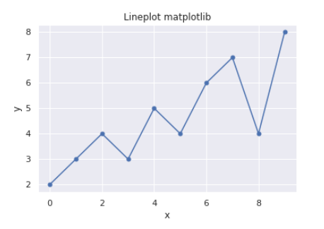
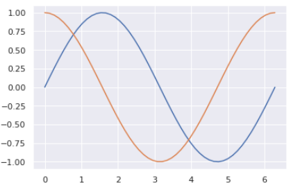
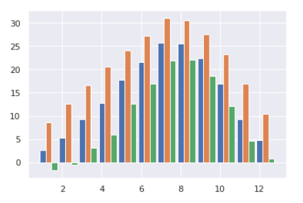
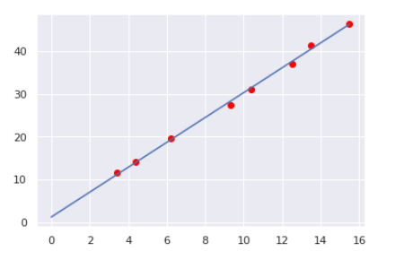

<!-- 表紙 -->

<div style="text-align: center;">
<div style="font-size: 32px;margin: 240px auto 0px">
第一回レポート
</div>
<div style="font-size: 24px;margin: 160px auto 0px">
報告者：EC2-10 山﨑 敦史
</div>
<div style="font-size: 24px;margin: 80px auto 160px">
提出日: 令和4年 8月8日
</div>
</div>

<div style="page-break-before:always"></div>

<!-- 以下レポート -->

# 課題1-1
> リスト1を参考に、プロット点に`.`を加えた折れ線グラフで書くプログラムkadai06101.ipynbを作成せよ。
> ソースプログラムのリストと実行結果のグラフの画像を報告書につけて提出すること。
> なお、グラフは縦横に目盛り線を入れた表示とするため、seabornライブラリを使用して描くこと。


ソースコードと実行画面の画像を以下に示す。

kadai06101.ipynb
```py
import numpy as np
import pandas as pd
import matplotlib.pyplot as plt
import seaborn as sns

sns.set()
x = np.array([0,1,2,3,4,5,6,7,8,9])
y = np.array([2,3,4,3,5,4,6,7,4,8])

plt.plot(x,y, marker=".", markersize = 10)
plt.title("Lineplot matplotlib")
plt.xlabel("x")
plt.ylabel("y")

plt.savefig("kadai06101")
```

実行画面の画像



# 課題1-2
> リスト2を参考に、`sin(x)`および`cos(x)`のグラフを描くプログラムkadai06102.ipynbを作成せよ。


ソースコードと実行画面の画像を以下に示す。

kadai06.ipynb
```py
import numpy as np
import matplotlib.pyplot as plt

x = np.linspace(0,2*np.pi,50)

plt.plot(x, np.sin(x))
plt.plot(x, np.cos(x))
```

実行画面の画像



# 課題2-1
> 2021年の１月から12月までの日平均の平均を棒グラフで表すプログラムを作成せよ。
> さらに、日最高の気温の月平均、日最低の気温の月平均を横にならべて表示できるようにせよ。
> おなじ、月に複数の棒グラフを横にならべて描くには、次のように月の位置xを幅0.3ずつずらし、`plt.bar()`の中で、某グラウの幅をwidth=0.3で調整して書く

ソースコードと実行画面の画像を以下に示す。

kadai06.ipynb
```py
import numpy as np
import pandas as pd
import matplotlib.pyplot as plt

months1 = list(range(1,13))
months2 = list(map(lambda value: value + 0.3, months1))
months3 = list(map(lambda value: value + 0.3, months2))

ave = [2.6,5.3,9.3,12.8,17.7,21.5,25.8,25.6,22.4,16.9,9.3,4.8]
high = [8.6,12.6,16.6,20.6,24.0,27.3,31.1,30.6,27.5,23.3,16.9,10.4]
low = [-1.8,-0.6,3.1,5.9,12.6,16.9,21.9,22.1,18.6,12.1,4.6,0.7]

plt.bar(months1, ave, width=0.3)
plt.bar(months2, high, width=0.3)
plt.bar(months3, low, width=0.3)
```

実行画面の画像



# 課題3-1
>スピーカーのパルス音を距離L[m]離れたマイクで受け取り、パルス音の発生からマイクで音を受け
取るまでの時間t[ ms ]を測定したものを下記の表に示す。
距離L[m]に対する時間t[ ms ]の関係は音速が一定であれば直線的な関係となる。（ t = a×L + b ）の関係式より、係数aと切片bを求めるkadai06301.ipynbのプログラムを作成せよ。
さらに、各データを散布図で描き、回帰直線をグラフに加えて描くとともに、係数aの値からこのときの音速の値を計算せよ


ソースコードと実行画面の画像を以下に示す。

kadai06.ipynb
```py
import numpy as np
import pandas as pd
import matplotlib.pyplot as plt
import seaborn as sns

sns.set()
l = np.array([3.41,4.40,6.19,9.33,10.41,12.5,13.48,15.49])
t = np.array([11.5,14.0,19.5,27.5,31.0,37.1,41.5,46.5])

def regline(x,y):
    n = len(x)
    a = ((np.dot(x,y) - y.sum()*x.sum()/n)/((x**2).sum() - x.sum() ** 2 /n))
    b = (y.sum() - a*x.sum()) / n
    return a,b

a,b = regline(l,t)
print(f'y = {a}x+{b}')

sonic = (1000-b)/a

print(f'音速={sonic}[m/s]')

plt.scatter(l, t, color ="red")
plt.plot([0,l.max()],[b,a*l.max()+b])
```

実行画面の画像



# 検討課題1-1
> 最小二乗法による回帰直線の傾きaおよび切片bが、(1)式および(2)式により導かれることを原理的に説明せよ

回帰直線は、回帰直線と

ソースコードと実行画面の画像を以下に示す。

kadai06.ipynb
```py
```

実行画面の画像

![kadai]